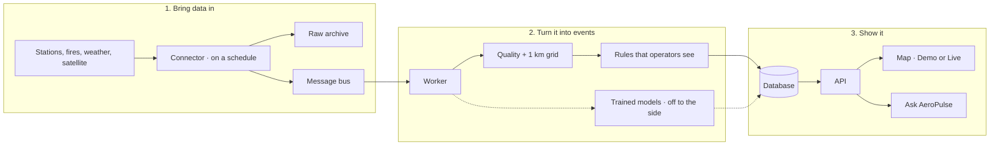

# How AeroPulse works

This is the system you get when you follow the [README setup](../README.md).  
Click-through version of the same story: [how-it-works.html](how-it-works.html).

## In one picture

## The ten steps

1. **Collect.** Each feed runs on its own timer. Out of the box, AeroPulse replays saved samples so you need no accounts. You can later point it at live Open-Meteo (no key), OpenAQ, and FIRMS (free keys). If a key is missing, that source says *not configured* and stays quiet.
2. **Clean the shape.** Vendor JSON stops at the door. Only a shared observation format continues. The original file is archived; the map never reads that archive.
3. **Queue.** Four streams: air quality, fire, weather, satellite/raster.
4. **Check and locate.** Bad or duplicate rows drop. A reading is placed on a 1 km cell.
5. **Score (what you actually see).** Events, PM2.5, anomaly, likely source, and plume motion come from **fixed rules** (nearby stations, history bands, wind). No chatbot on this path. A real station beats a model-derived value for the same cell and hour.
6. **Save.** Events, evidence, forecasts, and source health go to the database.
7. **Shadow (optional).** A trained model may score *after* the save. It cannot change what you see, and it cannot take the site down if it errors.
8. **API.** Read-only. 24-hour hazard and peak on this build copy the last value forward and are marked as degraded — not a probability.
9. **Map.** Demo is the scripted story. Live is the database. A failed Live request is named; Demo numbers are not slipped in.
10. **Ask AeroPulse.** The only place a language model is allowed. Every figure must come from a lookup. If that fails, you get a plain retrieval answer and a note that the model was not used.

In the HTML walkthrough: **cyan** is this path, **green** is the rules that answer, **orange** is a trained model that is not served, **violet** is Ask AeroPulse.

## What each number is

| You see | It is | It is not |
| --- | --- | --- |
| Grid PM2.5 | Distance-weighted stations | The trained boosting model |
| Anomaly | Unusual vs recent history | A certified alert |
| Source mix | Independent clues (fire + wind + PM) | A single “100% this factory” pie |
| Forecast | Wind carrying the plume | A calibrated chance of rain-style probability |
| Hazard / peak | Yesterday’s pattern carried forward | An 80% probability if you see 0.80 |
| Ask AeroPulse | Lookups + optional Gemini | Free-form invention |

A trained model is allowed onto the live path only after it beats a simple baseline on time, place, and season holdouts. A weekend of sample data is not enough.

Open-Meteo air quality is itself a **model** (CAMS), not a CPCB monitor. Do not quote it as station accuracy.

## Where to click

| You want | Go here |
| --- | --- |
| The map | http://127.0.0.1:5173 |
| Try an API call in the browser | http://127.0.0.1:8000/docs |
| Machine-readable API list | [openapi/openapi.v1.json](openapi/openapi.v1.json) |

## Not included in this build

Live Sentinel / MODIS / CAMS downloads, government login (OIDC), MLflow, extra monitoring SaaS, a graph database, citizen photo classification, Kubernetes, or calibrated “percent chance” hazard.
